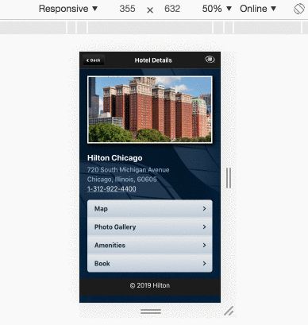

## Hotel Hilton Semantic HTML Demo
Coded by Tom. This project was bootstrapped with [Create React App](https://github.com/facebook/create-react-app).

## Assumptions
1. I build the html, css code within react assuming it would be integrated with the main code base in a real-world environment. The elements are component based including their respective stylesheets.

2. The hotel data is a JSON object placed in a separate file to simulate an external feed instead of hard-coding it.

3. CSS3 was used where feasible since its support has become more widespread in modern browsers.

4. Anchor tag <a> links contain no urls as there are no corresponding pages to navigate.

5. The background image sizing does not have a repeatable pattern therefore it is set as "cover" for size.

6. I changed the background image format from PNG to JPG in order to reduce file size, 64kb to 20kb without compromising image quality.

7. I set the Hilton logo in the header to be a homepage link in case the use wants to restart.

## Available Scripts

In the project directory, you can run:

### `yarn start`

Runs the app in the development mode. 
Open [http://localhost:3000](http://localhost:3000) to view it in the browser.

### `yarn build`

Builds the app for production to the `build` folder. 
It correctly bundles React in production mode and optimizes the build for the best performance.

The build is minified and the filenames include the hashes. 
Your app is ready to be deployed!

See the section about [deployment](https://facebook.github.io/create-react-app/docs/deployment) for more information.
